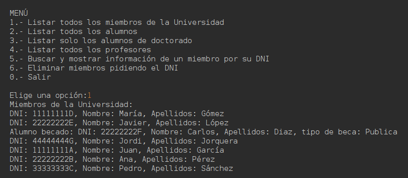
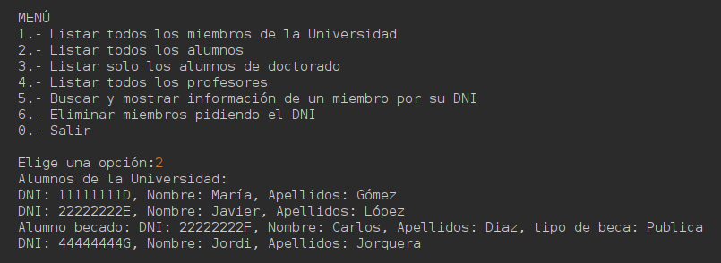
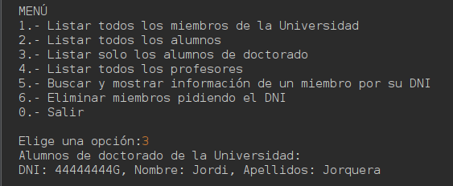
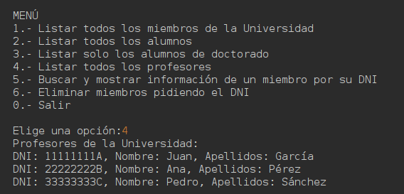
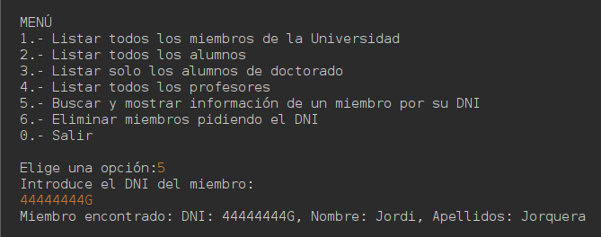
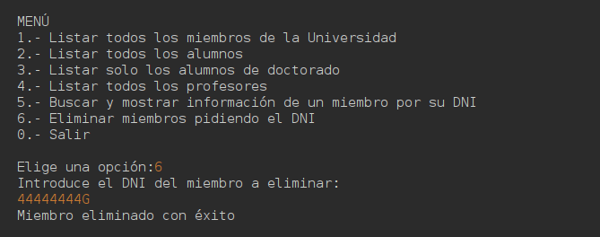

# 🎓 University Member Management - Java OOP Inheritance Project
A Java-based console application demonstrating **Object-Oriented Programming (OOP)** principles, particularly **Inheritance**, by managing different types of university members.

## 📸 Screenshots

### Main Menu and other options







### Member Search


## 🚀 Features
- **OOP Inheritance** structure with a base class `MembreUniversitat` and derived classes:
  - `Alumne`: Represents a general student.
  - `AlumneBecat`: A specialized student with a scholarship.
  - `AlumneDeDoctorat`: A doctoral student linked to a supervising professor.
  - `Professor`: Represents university professors.
- **University class** that stores and manages members.
- **Console-based Menu** with options to:
  - List all university members.
  - List students, doctoral students, and professors separately.
  - Search for members by their ID (DNI).
  - Remove a member by ID.
- **Test data loading** for quick functionality checks.

## 🛠️ Installation
Clone this repository and run the application:
```bash
 git clone https://github.com/YourGitHubUsername/UniversityMemberManagement-Java.git
 cd UniversityMemberManagement-Java
 javac -d bin src/ProjecteUF4/*.java
 java -cp bin ProjecteUF4.Main
```

## 🧠 How to Use
1. **Launch the program** to display the university management menu.
2. **Choose an option** from the menu to list, search, or remove members.
3. **Enter a valid ID (DNI)** when prompted for member operations.
4. **Enjoy testing the inheritance system** with preloaded data.

## 👨‍💻 Author
- **Your Name** — [GitHub](https://github.com/YourGitHubUsername)

Happy learning! 🎉

